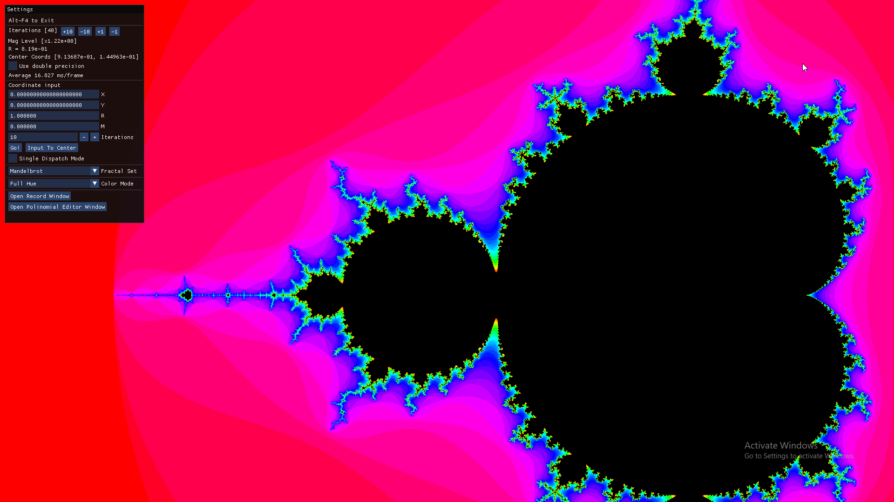

# Fractal Generator
This is a GPU, OpenGL, compute shader fractal renderer. Feature suggestions/pull requests are welcome.

Being a mostly project of mine made for fun, the source code is all on a single file... Setting up CMake for lib management also takes too much time for me :upside_down_face:.

| Feature | Implemented | Realtime<sup>1</sup> |
|-|:-:|:-:|
| 32-bit precision | :heavy_check_mark: | :heavy_check_mark: |
| 64-bit precision | :heavy_check_mark: | :x: |
| 128-bit precision<sup>2</sup> | :x: | :x: |
| Colored output<sup>3</sup> | :heavy_check_mark: | :heavy_check_mark: |
| Coordinate selection | :heavy_check_mark: | :heavy_check_mark: |
| Magnitude selection | :heavy_check_mark: | :heavy_check_mark: |
| Iteration selection | :heavy_check_mark: | :heavy_check_mark: |
| Adaptative iterations | :x: | :heavy_minus_sign: |
| Windowed mode | :x: | :heavy_minus_sign: |
| Video render<sup>4</sup> | :heavy_check_mark: | :x: |
| Shaders inside binary | :x: | :heavy_minus_sign: |

<sup>1</sup>Framerate may vary depending on hardware. Tested on a GXT 1070.

<sup>2</sup>Is this crazy on a GPU shader?

<sup>3</sup>Limited to single colored gradient or a fixed hue mode.

<sup>4</sup>Currenly only outputs binary ppm frames (`P6 - Portable PixMap`) to a numbered folder. Use some lib like `ffmpeg` to compress the frames into a video format.


| Set | Implemented |
|-|:-:|
| Mandelbrot set | :heavy_check_mark: |
| Burning ship set | :heavy_check_mark: |
| Custom polinomial sets | :x: |

Here is an image of the software running. The UI is relatively simple to grasp, just play around with it. This readme can explain it if you're willing to pull request :sweat_smile:.



### Compiling
```bash
mkdir build && cd build
cmake ..
cmake --build . --target ALL_BUILD --config Release
```
